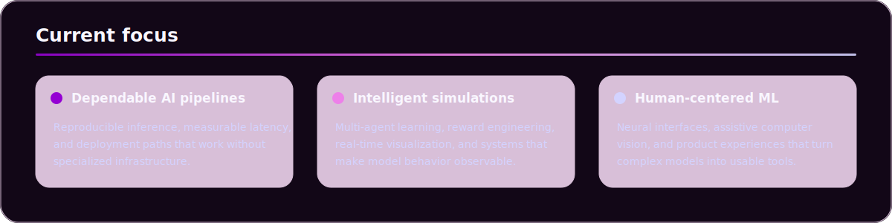
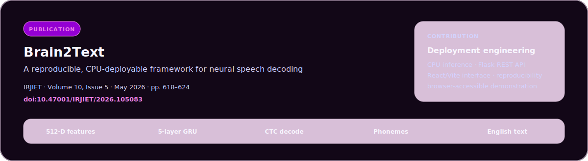
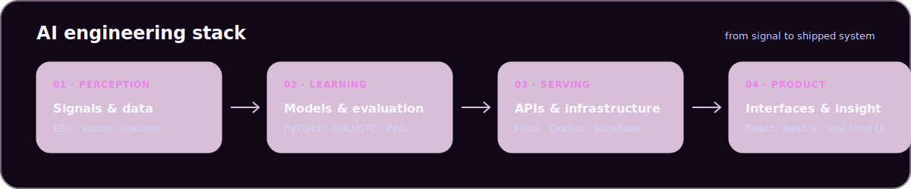
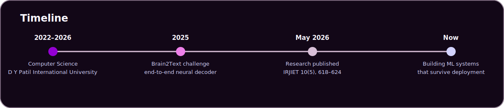

  

  

  
  &nbsp;
  
  &nbsp;
  
  &nbsp;
  
  &nbsp;
  
  &nbsp;
  
  &nbsp;
  
  &nbsp;
  
  &nbsp;
  
  &nbsp;
  
  &nbsp;
  
  &nbsp;
  

  <a href="#about">About</a>&nbsp;&nbsp;·&nbsp;&nbsp;
  <a href="#featured-work">Work</a>&nbsp;&nbsp;·&nbsp;&nbsp;
  <a href="#research">Research</a>&nbsp;&nbsp;·&nbsp;&nbsp;
  <a href="#engineering-stack">Stack</a>&nbsp;&nbsp;·&nbsp;&nbsp;
  <a href="#github-analytics">Analytics</a>&nbsp;&nbsp;·&nbsp;&nbsp;
  <a href="#contact">Contact</a>

  <a href="https://doi.org/10.47001/IRJIET/2026.105083">Research paper</a>&nbsp;&nbsp;·&nbsp;&nbsp;
  <a href="https://github.com/Aayush500214/Brain2Text">Brain2Text</a>&nbsp;&nbsp;·&nbsp;&nbsp;
  <a href="https://www.linkedin.com/in/aayush-chougule-8214831b6/">LinkedIn</a>

<!-- ABOUT: Keep this section concise. It is the recruiter-readable summary. -->

## About

I build AI systems end to end: from data and model behavior to APIs, interfaces, and deployment. My work spans neural speech decoding, multi-agent reinforcement learning, computer vision, and full-stack product engineering.

The thread connecting it all is practical research—systems should be reproducible, observable, and usable beyond the notebook. I am especially interested in machine learning systems, deployment engineering, and human-centered AI.

- Co-author of **Brain2Text**, an open-access 2026 research article on CPU-deployable neural speech decoding.
- Builder of public projects across reinforcement learning, assistive computer vision, and simulation.
- **AWS Certified Cloud Practitioner**, with hands-on work across Python, PyTorch, React, Flask, Docker, Supabase, and PostgreSQL.

 

<!-- FEATURED WORK: Lead with outcomes and technical substance, not repository counts. -->

## Featured work

### [Brain2Text](https://github.com/Aayush500214/Brain2Text)

An end-to-end neural decoding pipeline that maps 512-dimensional intracortical features to phonemes with a five-layer GRU + CTC decoder, then reconstructs English text. The project packages CPU inference behind a Flask API with a React/Vite interface and an offline demonstration mode.

`PyTorch` `GRU / CTC` `Flask` `React` `Neural decoding`

### [AI Football](https://github.com/Aayush500214/AI-Football)

A self-learning multi-agent football environment built around PPO and competitive self-play. It combines reward engineering, position-neutral training, persistent scoring, and real-time Pygame visualization so learning behavior can be inspected as it evolves.

`Python` `PPO` `Stable-Baselines3` `PettingZoo` `Pygame`

### [Sign Language Detection](https://github.com/Aayush500214/sign-language-detection)

A real-time assistive computer-vision system that turns webcam hand landmarks into alphabet predictions. MediaPipe handles landmark extraction; a machine-learning classifier performs gesture recognition with live visual feedback.

`OpenCV` `MediaPipe` `scikit-learn` `Computer vision` `Real-time ML`

### [FastBox Logistics Simulator](https://github.com/Aayush500214/Fast-Box-Logistics-Simulator)

A deployed last-mile delivery simulator with dynamic package assignment, an interactive Canvas visualization, and per-agent efficiency analytics. It exposes routing logic through a Flask backend and supports JSON input plus CSV export.

`Flask` `JavaScript` `HTML Canvas` `Simulation` `Analytics`

<!-- RESEARCH: Publication metadata is verified against the journal landing page and DOI. -->

## Research

**Gaurav Kumar Singh, Aayush Chougule, Uday Tomar, and Sidheshwar Sharma.** “Brain2Text: A Reproducible, CPU-Deployable Framework for Neural Speech Decoding with Browser-Accessible Inference.” *International Research Journal of Innovations in Engineering and Technology*, 10(5), 618–624, 2026. [DOI](https://doi.org/10.47001/IRJIET/2026.105083) · [Full text](https://irjiet.com/common_src/article_file/IRJIET1050831780017251.pdf) · [Code](https://github.com/Aayush500214/Brain2Text)

<!-- OPEN SOURCE: These are public builds; avoid implying upstream contribution history that is not verified. -->

## Public engineering

- **Reproducible AI demos** — model weights, inference paths, setup notes, and interfaces packaged together where possible.
- **Learning in the open** — public implementations for neural decoding, reinforcement learning, computer vision, and simulation.
- **Contributor-friendly foundations** — documented setup and contribution paths in projects such as [Sign Language Detection](https://github.com/Aayush500214/sign-language-detection).

<!-- STACK: Custom local SVG replaces a wall of third-party badges. -->

## Engineering stack

| Layer | Technologies |
|---|---|
| **Machine learning** | Python, PyTorch, Stable-Baselines3, scikit-learn, GRU/CTC, PPO |
| **Perception & data** | OpenCV, MediaPipe, NumPy, neural feature pipelines |
| **Product engineering** | TypeScript, React, Next.js, Flask, REST APIs, HTML Canvas |
| **Data & infrastructure** | PostgreSQL, Supabase, Docker, GitHub Actions, Vercel, AWS |

<!-- ANALYTICS: The local card is refreshed by .github/workflows/profile-assets.yml. -->

## GitHub analytics

  <picture>
    <source media="(prefers-color-scheme: dark)" srcset="./assets/generated/stats-dark.svg" />
    <source media="(prefers-color-scheme: light)" srcset="./assets/generated/stats-light.svg" />
    
  </picture>

### Development activity

<picture>
    <source media="(prefers-color-scheme: dark)" srcset="https://github-readme-activity-graph.vercel.app/graph?username=Aayush500214&amp;bg_color=120717&amp;color=d3d3ff&amp;line=ed80e9&amp;point=d8bfd8&amp;area=true&amp;hide_border=true&amp;hide_title=true" />
    <source media="(prefers-color-scheme: light)" srcset="https://github-readme-activity-graph.vercel.app/graph?username=Aayush500214&amp;bg_color=faf8ff&amp;color=5c3f62&amp;line=9400d3&amp;point=ed80e9&amp;area=true&amp;hide_border=true&amp;hide_title=true" />
    
</picture>

### Contribution visualization

<picture>
  <source media="(prefers-color-scheme: dark)" srcset="./assets/generated/contribution-snake-dark.svg" />
  <source media="(prefers-color-scheme: light)" srcset="./assets/generated/contribution-snake.svg" />
  
</picture>

The analytics card and contribution animation are generated inside this repository by GitHub Actions. GitHub’s native contribution calendar and activity feed continue immediately below the profile README.

<!-- TIMELINE -->

## Timeline

<!-- CONTACT: Keep contact paths high-signal and intentionally limited. -->

## Contact

I’m interested in AI/ML engineering, research collaboration, and systems that turn promising models into dependable products.

**[Connect on LinkedIn](https://www.linkedin.com/in/aayush-chougule-8214831b6/)** · **[Explore my GitHub](https://github.com/Aayush500214)** · **[Read Brain2Text](https://doi.org/10.47001/IRJIET/2026.105083)**

 

